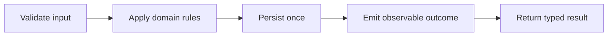

<div align="center">

# Product Engineering Playbook

**Practical patterns for shipping reliable products across backend, web, and mobile.**


`Design deliberately · Fail explicitly · Observe everything · Automate the repeatable`

</div>

---

## Why this exists

Production software is more than a working happy path. It needs clear boundaries, predictable failures, useful signals, and a delivery loop the team can trust.

This repository is a living collection of small, framework-light patterns I use when thinking about APIs and product delivery. The examples are written in TypeScript, but the ideas transfer naturally to NestJS services, React applications, Flutter clients, and CI/CD workflows.

## Operating principles

| Principle | What it looks like in code | Why it matters |
|---|---|---|
| **Explicit boundaries** | Validate and normalize at the edge | Invalid state never reaches the domain |
| **Typed failures** | Model expected errors as data | Callers handle outcomes deliberately |
| **Idempotent writes** | Give retries a stable identity | Network retries stay safe |
| **Useful observability** | Correlation IDs, structured logs, meaningful metrics | Failures can be explained, not guessed |
| **Behavior-first tests** | Test public contracts and important branches | Refactors stay cheap |
| **Automated delivery** | Lint, type-check, test, build, then deploy | Every release follows the same path |

## Patterns

| Pattern | Focus | Example |
|---|---|---|
| Result type | Make success and expected failure explicit | [`examples/result.ts`](examples/result.ts) |
| Service boundary | Normalize input, enforce domain rules, isolate persistence | [`examples/service-boundary.ts`](examples/service-boundary.ts) |

## A reliable request path



The shape is intentionally boring. Boring paths are easier to test, monitor, and operate.

## Delivery checklist

### Build

- Keep domain rules independent from transport and persistence.
- Validate external input once, at the boundary.
- Make retries and duplicate requests safe.
- Prefer small interfaces around infrastructure.

### Verify

- Cover success, expected failure, and infrastructure failure.
- Type-check and run tests before producing an artifact.
- Review migrations and API-contract changes explicitly.
- Exercise rollback or recovery paths before they are urgent.

### Operate

- Propagate a correlation ID across services.
- Log decisions and outcomes, not sensitive payloads.
- Alert on user impact and exhausted error budgets.
- Write the runbook while the failure mode is fresh.

## Repository map

```text
.
├── README.md
└── examples
    ├── result.ts
    └── service-boundary.ts
```

## Using the patterns

1. Start with the smallest pattern that solves the boundary you actually have.
2. Adapt names and error types to the domain instead of copying blindly.
3. Add a regression test for the behavior you need to protect.
4. Instrument the path before shipping it.

> These examples are deliberately compact. A production system still needs authentication, authorization, persistence strategy, observability, and operational safeguards suited to its risk.

---

<div align="center">
  <sub>Built as a practical reference for product engineers who own the path from idea to operation.</sub>
</div>
